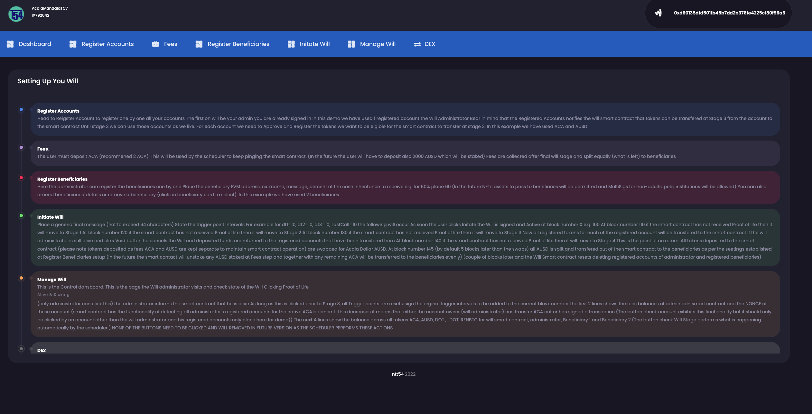

# NTT54 DEAD MAN SWITCH

## STEP 1 Intro
Instructions
 
 
 

 
 
 
## STEP 2 Register Your Accounts
Head to Register Account to register one by one all your accounts
The first onE will be your admin you are already signed in 
In this demo we have used 1 registered account the Will Administrator
Bear in mind that the Registered Accounts notifies the will smart contract that 
tokens can be transfered at Stage 3 from the account to the smart contract
Until stage 3 we can use those accounts as we like.
For each account we need to Approve and Register the tokens we want to be elgible for 
the smart contract to transfer at stage 3. In this example we have used ACA and AUSD
 
 
 

 
 
 				
## STEP 3 Deposit Fees 
The user must deposit ACA (recommened 2 ACA). This will be used by the scheduler to keep
pinging the smart contract.
(In the future the user will have to deposit also 2000 AUSD which will be staked)
Staked AUSD are collected after final will stage and split equally (what is left) to beneficiaries
Yield generated is sent to project treasury
 
 
 

 
 
 				
## STEP 4 Register Beneficiary Accounts
Here the administrator can register the beneficiaries one by one 
Place the beneficiary EVM address, nickname, message, percent of the cash inheritance to receive e.g. for 60% place 60
(In the future NFTs assets to pass to benefiaries will be permitted and MultiSigs for non-adults, pets, institutions will be allowed)
You can also amend beneficiaries' details or remove a beneficiary (click on beneficiary card to select). 
In this example we have used 2 beneficiaries
 
 
 

 
 
 
## STEP 5 InitiateWill
Place a generic final message (not to exceed 64 characters)  
State the trigger point intervals  
For example for dt1=10, dt2=10, dt3=10, LastCall=10 the following will occur  
As soon the user clicks Initate the Will is signed and Active at block number X e.g. 100 
At block number 110 if the smart contract has not received Proof of life then it will move to Stage 1 
At block number 120 if the smart contract has not received Proof of life then it will move to Stage 2 
At block number 130 if the smart contract has not received Proof of life then it will move to Stage 3 
    Now all registered tokens for each of the registered account will be transfered to the smart contract 
    If the will administrator is still alive and clicks Void button he cancels the Will and deposited funds are returned  to the registered accounts that have been transfered from  
At block number 140 if the smart contract has not received Proof of life then it will move to Stage 4 
    This is the point of no return. All tokens deposited to the smart contract (please note tokens deposited as fees ACA and AUSD are kept separate to maintain smart contract operation)
    are swapped for Acala Dollar AUSD. 
At block number 145 (by default 5 blocks later than the swaps) all AUSD is split and transfered out of the smart contract to the beneficiaries as per the seetings established at Register Beneficiaries setup 
(in the future the smart contact will unstake any AUSD staked at Fees step and together with any remaining ACA will be transferred to the beneficiaries evenly) 
(couple of blocks later and the Will Smart contract resets deleting registered accounts of administrator and registered beneficiaries)
 
 
 

 
 
 
## STEP 6 Manage Will <=> Dead Man Switch Control Panel
This is the Control dahsboard. This is the page the Will administrator visits and check state of the Will 
Clicking Proof of Life Alive & Kicking (only administrator can click this) the administrator informs the smart contract that he is alive  
As long as this is clicked prior to Stage 3, all Trigger points are reset using the orginal trigger intervals to be added to the current block number  
The first 2 lines show the fees balances of admin adn smart contract and the NONCE of these account 
(smart contract has the functionality of detecting all administrator's registered accounts for the native ACA balance. If this decreases it means that either the account owner (will administrator)
has transfer ACA out or has signed a transaction (The button <strong>Check Accounts</strong> exhibits this functionality but it should only be clicked by an account other than the will adminstrator and his registered accounts. The are only placed here for demo and will be removed in future versions)) 
The next 4 lines show the balance across all tokens ACA, AUSD, DOT , LDOT, RENBTC for 
will smart contract, administrator, Beneficiary 1 and Beneficiary 2 
(The button check Will Stage performs what is happening automatically by the scheduler ) 
NONE OF THE BUTTONS NEED TO BE CLICKED AND WILL BE REMOVED IN FUTURE VERSION AS THE SCHEDULER PERFORMS THESE ACTIONS
 
 
 

 
 
 
## ALL GOOD! NOW THAT YOU SECURED YOUR LOVED ONES GO ENJOY LIFE
 
 
 

## Video Link
 

 https://www.dropbox.com/home/2%20-%20Angelos/Hackathons/ETH%20Denver%20-%20Acala 

 
 
 

